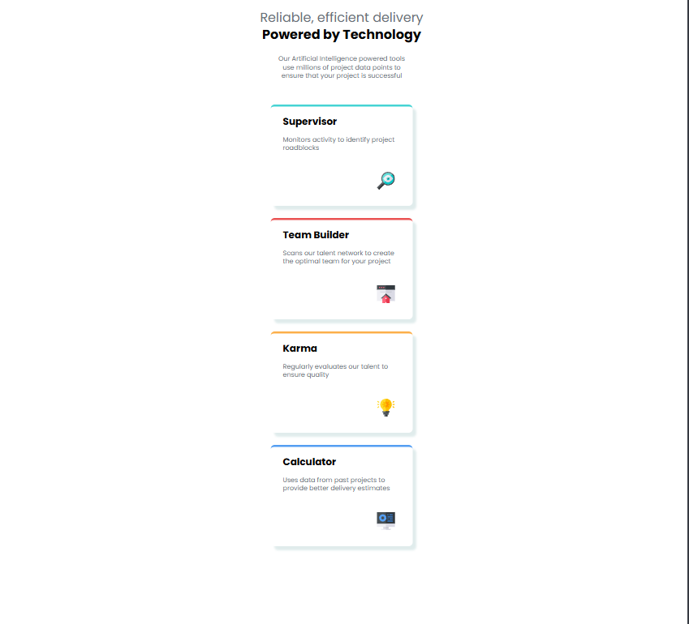
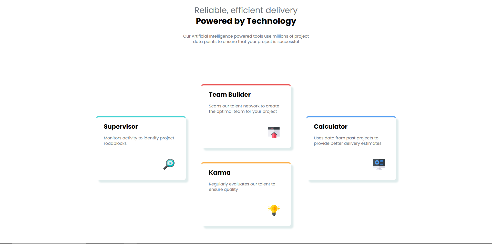

# Frontend Mentor - Four card feature section solution

This is a solution to the [Four card feature section challenge on Frontend Mentor](https://www.frontendmentor.io/challenges/four-card-feature-section-weK1eFYK). Frontend Mentor challenges help you improve your coding skills by building realistic projects. 

## Table of contents

- [Overview](#overview)
  - [The challenge](#the-challenge)
  - [Screenshot](#screenshot)
- [My process](#my-process)
  - [Built with](#built-with)
  - [What I learned](#what-i-learned)
  - [Useful resources](#useful-resources)

## Overview

### The challenge

Users should be able to:

- View the optimal layout for the site depending on their device's screen size

### Screenshot

## My process

### Built with

- Semantic HTML5 markup
- Flexbox
- Mobile-first workflow

### What I learned

For this project I learnt how to use media queries. I learnt what  mobile for approach is and built this project with tha in mind.

### Useful resources

- [Example resource 1](https://cssgenerator.org/box-shadow-css-generator.html) - This helped me generate box-shadows.
- [Example resource 2](https://fonts.google.com/selection) - This website helped me add a custom font to the project.
- [Example resource 2](https://www.w3schools.com/css/css_rwd_mediaqueries.aspn) - This is an amazing website which helped me understand media queries.
- [Example resource 2](https://developer.mozilla.org/en-US/docs/Web/CSS/Guides/Media_queries/Using) - This is an amazing website which helped me finally understand media queries.

